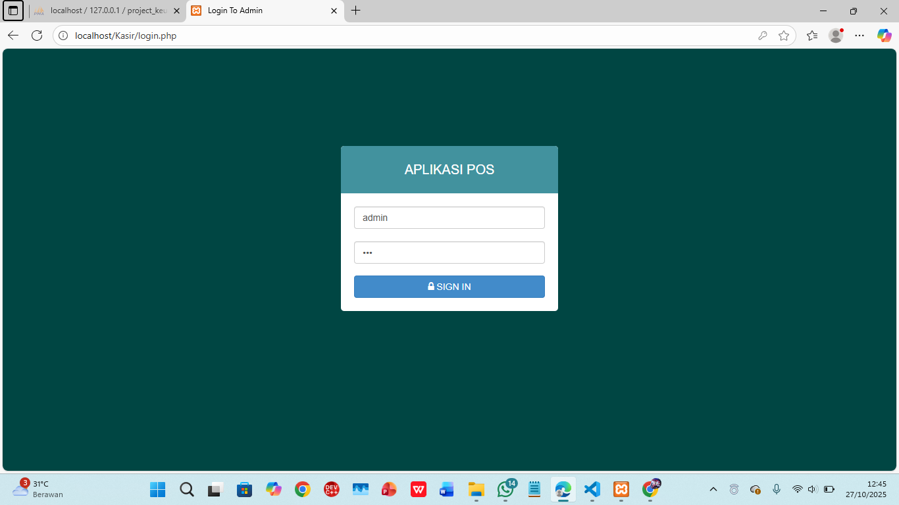
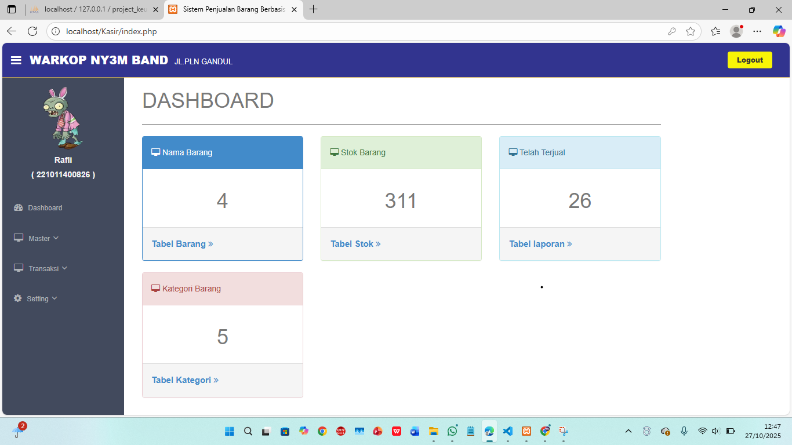

## Deskripsi Aplikasi 
Source Code Aplikasi Penjualan Barang sederhana berbasis Website dengan PHP & MYSQL.
 
 
Source Blog : <a href="https://www.codekop.com/read/source-code-aplikasi-penjualan-barang-kasir-dengan-php-amp-mysql-gratis.html" target="_blank">
https://www.codekop.com/read/source-code-aplikasi-penjualan-barang-kasir-dengan-php-amp-mysql-gratis.html</a>
 
 
<b> * Untuk Reuploader Source Code tolong cantumin sumber juga ya, terima kasih :)</b>

## Setting Koneksi PHP
setting koneksi di config.php dan ganti username, password dan dbname nya

## Penggunaan Login
Username : admin
 
Password : 123
 
* Penggunaan Login untuk <b>single User</b> 

## Contoh Program 
## 📸 Tampilan Aplikasi Kasir

### 🔐 Login

### 📊 Dashboard

### 📦 Data Barang

### 🗂️ Data Kategori

### 🛒 Keranjang / Transaksi

### 📑 Laporan Penjualan

### 🏪 Pengaturan Toko

### 👤 Profil Pengguna

## Changelog
31 Januari 2021 
- Tambah Sortir khusus stok kurang dari >= 3
- Cari Per Tanggal Laporan 
- Cari Per bulan Laporan
- Fix Perhitungan Laporan

06 Oktober 2020 
- revisi session error pada hosting dengan error : 
Warning: session_start(): Cannot send session cookie - headers already sent by (output started at [duplicate] -> fixed
- Ganti background login, header
- Ganti Header table barang, table keranjang, table laporan
- Fix transaksi -> transaksi stok < keranjang tidak bisa diproses
- penghapusan trigger sql
- penambahan fungsi transaksi untuk pengurangan stok barang setelah transaksi bayar 

23 Agustus 2020 
- revisi print
- menambahkan alert telah di bayar di bagian bayar transaksi penjualan

18 Juli 2020 
- fix edit kategori
- fix modal tambah barang
- rapihin form laporan

29 Agustus 2019  
- laporan tampilan error  -> fixed
- klik button bayar transaksi  tidak masuk ke laporan -> fixed
- pencarian barang pada menu transaksi sudah otomatis dengan tambahan jquery ajax
- data laporan dapat dicari berdasarkan periode bulan dan tahun

 
** Jika ada issues atau revisi atau menambahkan fitur silahkan pull request di repository ini

## Contributors
<a href="https://fauzan.codekop.com/"> Fauzan Falah</a>

My Blog : <a href="https://www.codekop.com/"> Codekop.com</a>

Gunakan Aplikasi dengan bijak, dan Selamat Belajar
